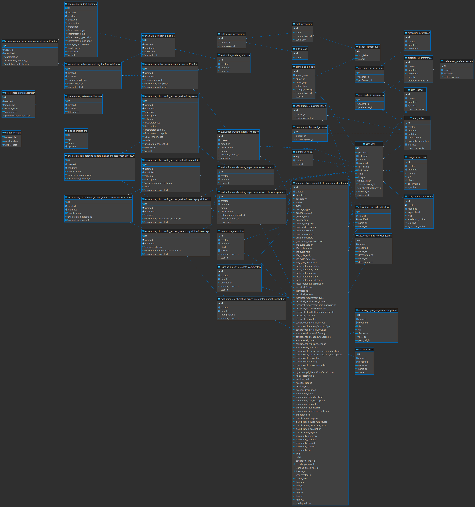
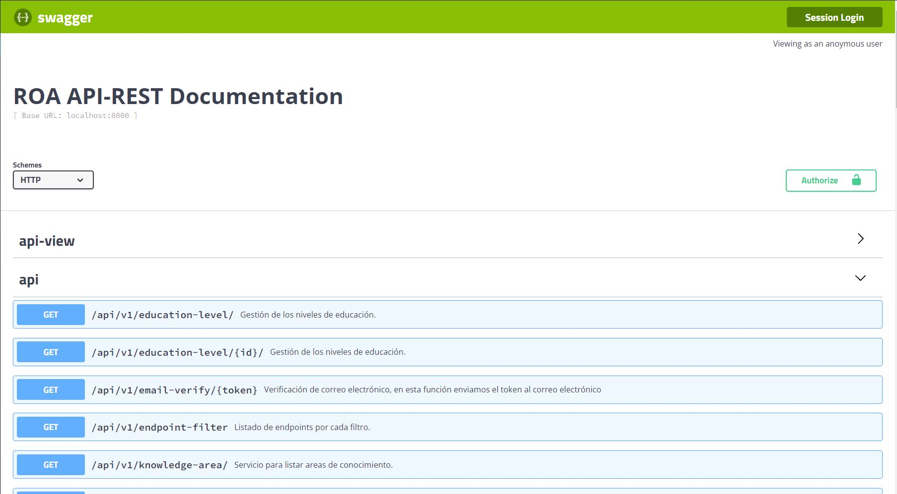

# Repositorio de Objetos de Aprendizaje (ROA) 

Este proyecto es la parte Backend del <a href="https://repositorio.edutech-project.org/#/">Repositorio de Objetos de Aprendizaje</a>.

## Empezar 🚀

Estas instrucciones te permitirán obtener una copia del proyecto en funcionamiento en tu máquina local para propósitos de desarrollo y pruebas.

<ul>
 <li>
  <a href="https://github.com/EduTech-Erasmus-Project/Repositorio-Frontend.git">Frontend repositorio de objetos de aprendizaje (ROA)</a>
 </li>
</ul>

### Pre-requisitos 📋

Instalación de Python 3

- Linux

```
sudo apt-get install python3-pip

```

   Observar la version de python

```
python3 -V
```

- Windows

   Puedes descargarlo del siguiente enlace

   https://www.python.org/downloads/

Entorno virtual 

```
python3 -m venv ejemplo-env
```

## Instalación 🔧

- Instalar requerimientos 

```
pip install –r requirements.txt 
``` 

## Diagrama de la base de datos 📊

- Ver en pantalla completa <a href="https://github.com/EduTech-Erasmus-Project/Repositorio-Backend/blob/main/ROABD.png">clic aqui.</a>

<p align="center">

</p>
 
### Configuracion de la base de datos

PostgreSQL

- Instalación Windows

  https://www.postgresql.org/
  
 - Instalación Linux

```
sudo apt-get -y install postgresql
```

Creación de usuario y base de datos en postgresql 

```
CREATEDB roaTestDB
```

```
CREATEUSER roaTestUser
```

```
Psql roaTest
```

```
ALTER USER roaTestUser WITH PASSWORD 'contraseña';
```

### Configuración en el archivo settings.py

```
DATABASES = {
    'default': {
        'ENGINE': 'django.db.backends.postgresql_psycopg2',
        'NAME': 'roaTestDB',
        'USER': 'roaTestUser',
        'PASSWORD': 'contraseña',
        'HOST': 'localhost',
        'PORT': '5434',
    }
}
```

## Ejecución de proyecto 

Para la ejecucucion del proyecto situarse a la altura del archivo manage.py

```
python manage.py makemigrations
```

```
python manage.py migrate
```

```
python manage.py runserver
```

# Documentación API-REST 📋

<p align="center">

</p>
 
- La documentación del API-REST es generada por la herramienta `swagger`, para visualizar la documentación en el servidor local diríjase a la siguiente dirección `http://localhost:8000/api-view`. Para ver la documentación de la aplicacion de producción visite la siguiente dirección <a  href="https://repositorio.edutech-project.org/api-view">https://repositorio.edutech-project.org/api-view</a>
