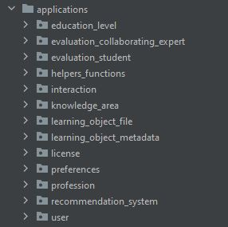

# Repositorio de Objetos de Aprendizaje (ROA) 

Este proyecto es la parte Backend del <a href="https://repositorio.edutech-project.org/#/">Repositorio de Objetos de Aprendizaje</a>.

## Empezar 🚀

Estas instrucciones te permitirán obtener una copia del proyecto en funcionamiento en tu máquina local para propósitos de desarrollo y pruebas.

<ul>
 <li>
  <a href="https://github.com/EduTech-Erasmus-Project/Repositorio-Frontend.git">Frontend repositorio de objetos de aprendizaje (ROA)</a>
 </li>
</ul>

### Pre-requisitos 📋

Instalación de Python 3

- Linux

```
sudo apt-get install python3-pip

```

   Observar la version de python

```
python3 -V
```

- Windows

   Puedes descargarlo del siguiente enlace

   https://www.python.org/downloads/

Entorno virtual 

```
python3 -m venv ejemplo-env
```

## Instalación 🔧

- Instalar requerimientos 

```
pip install –r requirements.txt 
``` 

## Aplicaciones dentro del proyecto 📂

<p align="center">

</p>

- Nivel de Educación 

_En esta aplicación `education_level` se trabajan temas relacionados con los niveles de educación, que pueden ser, por ejemplo, educación primaria, educación secundaria entro otros._

- Evaluación Experto Colaborador

_En esta aplicación `evaluation_collaborating_expert` se trabaja la parte de evaluación de experto colaborador, con diferentes APIs que hacen referencia a los resultados de evaluaciones de expertos hacia los objetos de aprendizaje, evaluaciones automáticas a los objetos de aprendizaje, entro otros más._

- Evaluación Estudiante

_En esta aplicación `evaluation_student ` se trabaja la parte de evaluación del estudiante, con diferentes APIs que hacen referencia a los resultados de evaluaciones de estudiantes hacia los objetos de aprendizaje, evaluación principal, entro otros más._

- Funciones de ayuda

_En esta aplicación `helpers_functions ` se trabaja la parte funciones de ayuda, dentro de esta aplicación podemos encontrar, métodos de webscraping, lectura de elementos HTML, comparación de información, entre otros._

- Interacción

_En esta aplicación `interaction ` se trabaja la interacción de estudiante con el objeto de aprendizaje. La interacción se trabaja en base a me gusta sobre el objeto de aprendizaje._

- Área de conocimiento

_En esta aplicación `knowledge_area ` se trabaja las áreas de conocimiento, existen un CRUD para esta área de conocimiento._

- Archivo del Objeto de Aprendizaje 

_En esta aplicación `learning_object_file ` se trabajan servicios como, servicio para cargar un OA comprimido y obtener los metadatos correspondientes al Objeto de Aprendizaje y borrar un OA._

- Metadatos del Objeto de Aprendizaje

_En esta aplicación `learning_object_metadata ` se trabaja servicios como reconocimientos de metadatos del objeto de aprendizaje, evaluación de metadatos de objetos de aprendizaje entre otros servicios._

- Lincencia 

_En esta aplicación `license ` se trabaja servicios para el CRUD licencias. CREATE & UPDATE son accesibles para usuarios administrador autenticado correctamente. LIST & RETRIEVE son servicios accesibles para usuarios anónimos._

- Preferencias 

_En esta aplicación `preferences ` se trabaja servicios para el CRUD de preferencias de usuarios._

- Profesión 

_En esta aplicación `profession ` se trabaja servicios para el CRUD de profesiones._

- Recomendación del sistema

_En esta aplicación `recommendation_system ` se trabaja servicios para el CRUD de las recomendaciones del sistema en este caso listar los objetos de aprendizaje más populares._

- Usuario

_En esta aplicación `user ` se trabaja servicios para el CRUD para el usuario. En esta aplicación se encuentran los métodos para autentificación de usuarios, uso de tokens para sesión, entro otros servicios._

## Diagrama de la base de datos 📊

- Ver en pantalla completa <a href="https://github.com/EduTech-Erasmus-Project/Repositorio-Backend/blob/main/ROABD.png">clic aqui.</a>

<p align="center">

</p>
 
### Configuracion de la base de datos

PostgreSQL

- Instalación Windows

  https://www.postgresql.org/
  
 - Instalación Linux

```
sudo apt-get -y install postgresql
```

Creación de usuario y base de datos en postgresql 

```
CREATEDB roaTestDB
```

```
CREATEUSER roaTestUser
```

```
Psql roaTest
```

```
ALTER USER roaTestUser WITH PASSWORD 'contraseña';
```

### Configuración en el archivo settings.py

```
DATABASES = {
    'default': {
        'ENGINE': 'django.db.backends.postgresql_psycopg2',
        'NAME': 'roaTestDB',
        'USER': 'roaTestUser',
        'PASSWORD': 'contraseña',
        'HOST': 'localhost',
        'PORT': '5434',
    }
}
```

## Ejecución de proyecto 

Para la ejecucucion del proyecto situarse a la altura del archivo manage.py

```
python manage.py makemigrations
```

```
python manage.py migrate
```

```
python manage.py runserver
```

# Documentación API-REST 📋

<p align="center">

</p>
 
- La documentación del API-REST es generada por la herramienta `swagger`, para visualizar la documentación en el servidor local diríjase a la siguiente dirección `http://localhost:8000/api-view`. Para ver la documentación de la aplicacion de producción visite la siguiente dirección <a  href="https://repositorio.edutech-project.org/api-view">https://repositorio.edutech-project.org/api-view</a>

## Confiuracion del servidor de correo 📪

_<a href="https://sendgrid.com/">SendGrid</a> es una plataforma estadounidense para la gestión de correos electrónicos transaccionales y comerciales._
